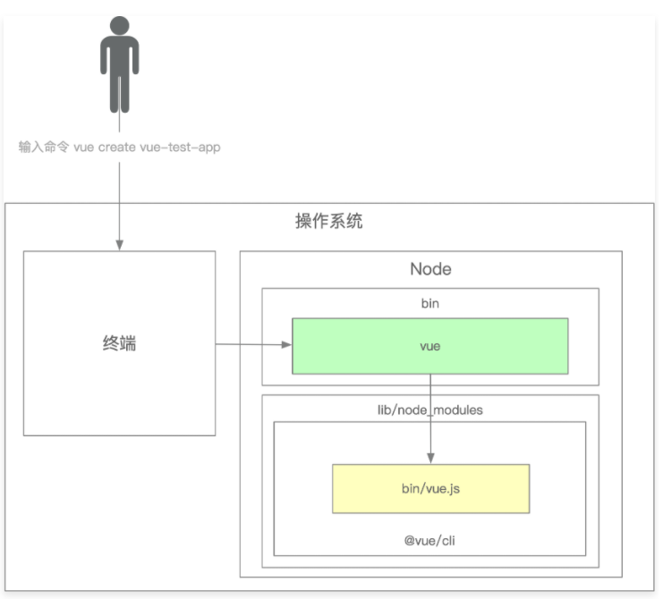

# 记录
## 脚手架

### 脚手架命令

```js
vue create vue-test-app
```
上面的命令由3个部分组件：

+ 主命令:`vue`
+ command:`create`
+ command的param: `vue-test-app`

覆盖当前目录下的文件，强制安装vue项目：

```js
vue create vue-test-app --force
```

`--force`：叫做option,用来辅助脚手架确认在特定场景下用户的选择的配置

覆盖当前目录下的文件，强制安装vue项目，修改npm源为淘宝源。

```js
vue create vue-test-app --force -r https://registry.npm.taobao.org
```

`-r`：也叫做option。是`--registry`的简写方式。`-r`后面的地址称为option的param。其实`--force`可以理解为：`--force true`，简写为：`--force`或`-f`


## npm使用技巧

### 寻找npm命令执行的地址

`which vue`：找到vue命令执行的目录地址

` which yarn`：找到yarn命令行的目录地址

...

### 脚手架的执行原理



mac 安装`-g`的全局目录一般为`~/.nvm/versions/node/v15.0.0/lib/node_modules`

脚手架的执行原理：

1. 在终端输入`vue create vue-test-app`

2. 终端解析出`vue`是命令

3. 终端在环境变量中找到`vue`命令,相等于执行了`which vue`来找到执行的文件

   `which vue`实际指向的是node的bin中生成`@vue/cli`的一个软连接

4. 终端在node bin中根据`vue`命令的软连接，通过软连接找到到实际文件`vue.js`中

5. 终端通过`vue.js`文件头部代码定义`/usr/bin/env node`确定利用`node`执行`vue.js`

6. `vue.js`解析command/options

7. `vue.js`执行command

8. 执行完毕，退出执行

实际执行的命令是`@vue/cli`包中根据package.json文件中 bin中的vue

```json
"bin":{
    "vue":"bin/vue.js"
}
```

`npm install -g @vue/cli`发生了什么？

1. 会去下载vue cli然后把包安装到node目录下的lib文件夹下的node_modules中
2. 解析刚下的`@vue/cli`包中的package.json找到bin的配置
3. 在package.json的bin中找到主命令vue。
4. 然后利用这个主命令在node的bin中注册一个软连接`vue@:实际地址`，这个软连接指向node lib目录下node_modules中`@vue/cli`的实际执行文件`vue.js`


### npm 本地调试

> 指向本地目录使用的都是软连接也就是快捷方式，所以本地修改了js文件，命令中的内容也直接会被替换掉。这样就容易调试，不需要频繁的发布npm(npm publish)包和下载包(npm install)

在本包的上级目录`npm install -g lilon` 这样安装使用lilon命令指向的就是lilon包的本地地址。
还有一种就是进入本包lilon中使用`npm link`。这样调试指向的也是本包的本地地址,`npm link`链接到全局，全局会有这个包，但是这个包指向自己的本地

mac 安装`-g`的全局目录一般为`~/.nvm/versions/node/v15.0.0/lib/node_modules`这个里面,是用`ll`命令查看是否是软链接

### 本地依赖调试

比如：lilon依赖是lilon-lib，需要lilon-lib在本地`npm link`一下，然后在lilon中`npm link lilon-lib`一下。查看lilon中的package.json中的dependencies是否正确引用。

取消链接`npm unlink` 或者 `npm unlink lilon-lib`


## Lerna学习

`lerna create <name> [loc]:`创建一个可以被lerna管理的package。loc:需要指定一个安装路径。

`lerna add <package>[@version] [--dev] [--exact] [--peer]`：对指定的package安装相关的依赖，如果没有指定，leran下所有的package都会安装这个依赖。

`lerna add @lilon-cli/utils packages/core/`:指定单独包的依赖。

`lerna clean`：清空所有包的依赖

`lerna bootstrap`：重新安装所有的依赖，并实现软连接.

`lerna link`：将lerna下面所有的package包的依赖进行link操作

`lerna exec -- <command> [...args]`：在每一个package中执行命令。例如：

```shell
lerna exec -- rm -rf ./node_modules
lerna exec -- protractor conf.js
```

`lerna exec --scope <package> -- <command>`：指定package中执行命令。例如：

```shell
lerna exec --scope @lilon-cli-dev/core -- rm -rf ./node_modules
```

指定`@lilon-cli-dev/core`包中删除node_modules

`lerna run <script> -- [..args]`执行npm 的script。例如：

```shell
lerna run test
lerna run build
lerna run --scope @lilon-cli-dev/core build
```

同样`--scope`一样可以使用

新建码云仓库。

```shell
git remote -v #查看是否有远程仓储
git remote add origin git@gitee.com:xxxxx.git #设置远程仓储
git push --set-upstream origin master #推送到远程分支上，并设置master为默认推送分支
git checkout -- learn.debug.log #删除所要提交的文件

```

### lerna发布

1. 登录npm
2. 修改所有package.json和lerna.json中version版本一直。并且这个版本是在npm仓库中最新的，npm没有救是1.0.0
3. 提交代码到github仓储中
4. 然后`lerna publish`

### 删除npm已发布的包

```shell
npm unpublish @lilon-cli-dev@1.0.0
```

- 使用命令npm unpublish xxx@1.1.1（包名@版本名）删除指定版本
- 根据规范，只有在发包的**24小时内才允许**撤销发布的包（ unpublish is only allowed with versions published in the last 24 hours），需要我们发邮件给官方来删除
- **即使**你撤销了发布的包，**发包的时候也不能再和被撤销的包的名称和版本重复了**（即不能名称相同，版本相同，因为这两者构成的唯一标识已经被“占用”了）
- 例如我在撤销包后尝试再发布同一名称+同一版本的包