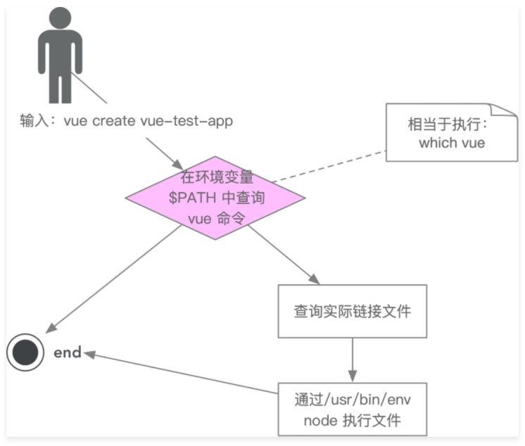

# 记录
## 脚手架

### 脚手架命令

```js
vue create vue-test-app
```
上面的命令由3个部分组件：

+ 主命令:`vue`
+ command:`create`
+ command的param: `vue-test-app`

覆盖当前目录下的文件，强制安装vue项目：

```js
vue create vue-test-app --force
```

`--force`：叫做option,用来辅助脚手架确认在特定场景下用户的选择的配置

覆盖当前目录下的文件，强制安装vue项目，修改npm源为淘宝源。

```js
vue create vue-test-app --force -r https://registry.npm.taobao.org
```

`-r`：也叫做option。是`--registry`的简写方式。`-r`后面的地址称为option的param。其实`--force`可以理解为：`--force true`，简写为：`--force`或`-f`


## npm使用技巧

### 寻找npm命令按照的地址

`which vue`：找到vue命令安装的目录地址

` which yarn`：找到yarn命令安装的目录地址

...

### 脚手架的执行原理



mac 安装`-g`的全局目录一般为`~/.nvm/versions/node/v15.0.0/lib/node_modules`

脚手架的执行原理：

1. 在终端输入`vue create vue-test-app`
2. 终端解析出`vue`命令
3. 终端在环境变量中找到`vue`命令
4. 终端根据`vue`命令链接到实际文件`vue.js`中
5. 终端利用`node`执行`vue.js`
6. `vue.js`解析command/options
7. `vue.js`执行command
8. 执行完毕，退出执行


### npm 本地调试

> 指向本地目录使用的都是软连接也就是快捷方式，所以本地修改了js文件，命令中的内容也直接会被替换掉。这样就容易调试，不需要频繁的发布npm(npm publish)包和下载包(npm install)

在本包的上级目录`npm install -g lilon` 这样安装使用lilon命令指向的就是lilon包的本地地址。
还有一种就是进入本包lilon中使用`npm link`。这样调试指向的也是本包的本地地址

mac 安装`-g`的全局目录一般为`~/.nvm/versions/node/v15.0.0/lib/node_modules`这个里面,是用`ll`命令查看是否是软链接

### 本地依赖调试

比如：lilon依赖是lilon-lib，需要lilon-lib在本地`npm link`一下，然后在lilon中`npm link lilon-lib`一下。查看lilon中的package.json中的dependencies是否正确引用。